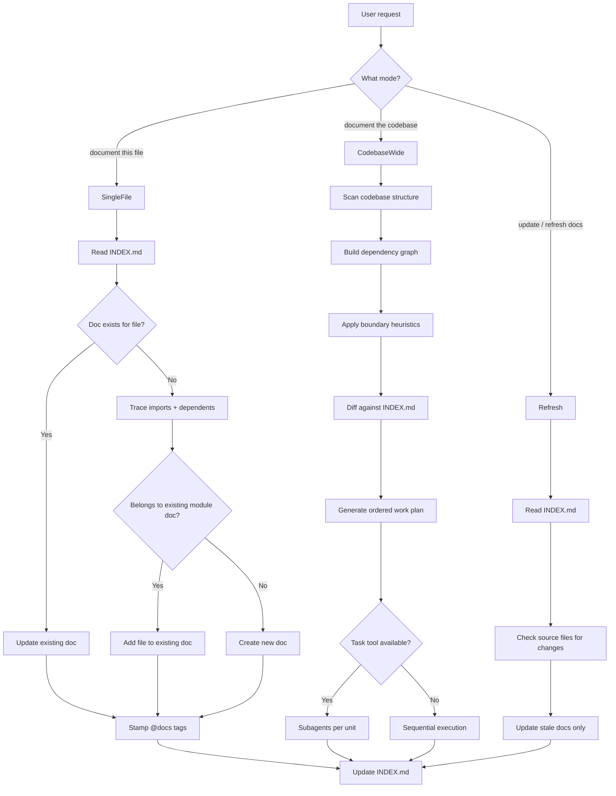

# Codebase-Docs Skill

## Architecture

The new skill lives alongside `auto-docs` at [`auto-docs/`](auto-docs/) and introduces a documentation **system** rather than a single-shot workflow. It operates in three modes, shares auto-docs' document template format, and uses `/docs/INDEX.md` as the source of truth for what's documented where.



---

## Skill directory structure (progressive disclosure)

```
codebase-docs/
├── SKILL.md                   # Core: mode detection, single-file workflow, orchestration dispatch
├── planning.md                # Codebase scan, dependency graphing, boundary heuristics
├── index-format.md            # INDEX.md schema, how to read/write/update it
├── overlap-resolution.md      # Primary vs secondary docs, cross-reference rules
└── sync-rule-template.md      # Enhanced sync rule (multi @docs + INDEX.md awareness)
```

The agent reads **only `SKILL.md`** for single-file mode. It reads supplementary files only when the mode requires them:

- Codebase-wide mode: read `planning.md` then `index-format.md`
- Overlap detected: read `overlap-resolution.md`
- First run: read `sync-rule-template.md`

---

## File-by-file design

### 1. `SKILL.md` (~300-400 lines)

The main entry point. Contains:

**Step 0 — Bootstrap.** Same as auto-docs: install the enhanced sync rule from [sync-rule-template.md](sync-rule-template.md) to `.cursor/rules/documentation-sync.mdc` if missing.

**Step 1 — Mode detection.** Parse user intent:

- "document X" / "document this file" / "create docs for component Y" → **single-file mode**
- "document the codebase" / "document everything" / "generate all docs" → **codebase-wide mode** (read [planning.md](planning.md))
- "update docs" / "refresh documentation" / "sync docs" → **refresh mode**

**Step 2 — Read INDEX.md.** All modes start by reading `/docs/INDEX.md`. If it doesn't exist, create a skeleton. The INDEX.md tells the agent what's already documented, preventing redundant work.

**Step 3 — Single-file workflow** (inline in SKILL.md since it's the common case):

1. Read the target file
2. Trace its imports and consumers (1 level deep)
3. Look up all traced files in INDEX.md
4. If a primary doc already exists for this file → update it (only sections affected by changes)
5. If the file is covered as secondary in another doc → decide whether it's significant enough for its own doc or should be added to the existing one
6. If no doc exists → create one using the document template
7. Stamp all related source files with `@docs` tags (comma-separated, primary first)
8. Update INDEX.md

**Step 4 — Codebase-wide dispatch.** Short section that says: "Read [planning.md](planning.md) for the full scan/plan/execute workflow."

**Step 5 — Refresh workflow** (inline, ~30 lines):

1. Read INDEX.md
2. For each entry, check if the source files have been modified (use git diff or file inspection)
3. Skip files that haven't changed
4. For changed files, update only the affected doc sections
5. Update INDEX.md timestamps

**Step 6 — Document template.** Same structure as auto-docs (Title, Summary, Overview, Architecture/Flow, Key Concepts, Usage Examples, API Reference, Related Files, References) but with two additions:

- The **Related Files** table gains a **Role Type** column: `primary` or `reference`
- The **References** section explicitly links to other docs that share files with this doc

**Step 7 — JSDoc stamping.** Same as auto-docs but with enhanced `@docs` tag:

```
@docs /docs/auth.md, /docs/middleware.md
```

First path is the primary doc. The sync rule uses all paths. If a file already has `@docs` tags, merge — don't replace.

**Step 8 — Verification checklist.** Extended from auto-docs to include:

- INDEX.md updated
- No orphaned entries in INDEX.md
- Cross-references consistent (if doc A references doc B, doc B's References section links back)

### 2. `planning.md` (~200 lines)

Read only during codebase-wide mode. Contains:

**Scan phase:**

- List all source files (exclude node_modules, dist, build, .git, etc.)
- Build a lightweight dependency graph by scanning imports
- Group files by directory proximity + import clustering

**Boundary heuristics (hybrid strategy):**

- **Module-level docs**: any directory with 3+ related files gets its own doc (e.g., `src/lib/auth/` → `auth.md`)
- **Shared utility docs**: files imported by 3+ other modules get their own doc (e.g., `src/utils/validation.ts` → `validation-utils.md`)
- **Leaf files**: files that are only used within one module are covered in that module's doc as Related Files, not as standalone docs
- **Route/page docs**: each route group gets a doc if it has server actions, loaders, or complex logic
- **Config files**: grouped into a single `configuration.md` unless complex enough to warrant splitting

**Dependency ordering:**

- Document shared utilities first (they'll be referenced by module docs)
- Then modules in dependency order (if A depends on B, document B first so A can reference it)
- Then routes/pages last (they reference everything)

**Execution strategy:**

- Generate an ordered work plan as a checklist
- If Task tool is available: dispatch one subagent per documentation unit, providing it with the single-file workflow from SKILL.md plus the specific files to document. Include INDEX.md content in each subagent prompt so it knows what exists.
- If no Task tool: execute sequentially, re-reading INDEX.md between units to stay current. Use the TodoWrite tool to track progress.
- Cap at ~5-8 source files per documentation unit to keep each agent turn within context limits.

### 3. `index-format.md` (~100 lines)

Defines the INDEX.md schema and CRUD operations.

**INDEX.md format:**

```markdown
# Documentation Index

> Auto-managed by codebase-docs. Manual edits will be overwritten.

## Documents

| Document                                   | Status | Covers                    | Last Updated |
| ------------------------------------------ | ------ | ------------------------- | ------------ |
| [auth.md](auth.md)                         | Active | `src/lib/auth/`           | 2026-04-03   |
| [database.md](database.md)                 | Active | `src/lib/db/`             | 2026-04-03   |
| [validation-utils.md](validation-utils.md) | Active | `src/utils/validation.ts` | 2026-04-03   |

## File Map

| Source File               | Primary Doc                                | Also Referenced In                       |
| ------------------------- | ------------------------------------------ | ---------------------------------------- |
| `src/lib/auth/session.ts` | [auth.md](auth.md)                         | [database.md](database.md)               |
| `src/lib/db/client.ts`    | [database.md](database.md)                 | -                                        |
| `src/utils/validation.ts` | [validation-utils.md](validation-utils.md) | [auth.md](auth.md), [forms.md](forms.md) |
```

**Operations:**

- **Lookup**: given a source file path, find its primary doc and secondary docs
- **Add entry**: when creating a new doc, add to both tables
- **Update entry**: when modifying a doc, update the Last Updated column
- **Remove entry**: when a source file is deleted, mark its row (don't delete — flag as orphaned for user review)
- **Merge check**: before creating a new doc, check if the file is already covered. If so, return the existing doc path instead.

### 4. `overlap-resolution.md` (~80 lines)

Rules for when a file appears in multiple documentation units:

**Primary vs secondary:**

- A file has exactly ONE primary doc — the doc that covers it in depth (architecture, API reference, examples)
- A file can appear as secondary in unlimited other docs — mentioned in their Related Files table with role `reference`, included in their Mermaid diagrams, but not deeply explained

**How to assign primary:**

- The primary doc is the one whose documentation unit the file most naturally belongs to (same directory, same feature domain)
- Shared utilities: the utility's own doc is primary; every consumer doc references it as secondary
- If ambiguous: prefer the doc with fewer files (more focused coverage)

**Cross-reference rules:**

- When doc A has a secondary reference to file F, and file F's primary doc is doc B: add `[doc-b.md](doc-b.md)` to doc A's References section
- When creating doc B, check INDEX.md for any docs that already reference file F as secondary — add back-links

### 5. `sync-rule-template.md` (~40 lines)

Enhanced version of the current [rule-template.md](auto-docs/rule-template.md):

```markdown
---
alwaysApply: true
---

# Documentation Sync

> Installed by codebase-docs. Keeps /docs files and INDEX.md current when source files change.

## Rule: Keep /docs in sync with source files (REQUIRED)

If a file you are editing contains one or more `@docs` tags in its JSDoc — for example:

\`\`\`ts
/\*\*

- @docs /docs/auth.md, /docs/middleware.md
  \*/
  \`\`\`

You MUST do all of the following as part of the same task:

1. Update the JSDoc in the file you just edited (refresh @description, @behavior, @depends-on, @depended-by).
2. For EACH doc path listed in the @docs tag (comma-separated):
   a. Read that /docs file.
   b. Update any sections affected by your changes.
3. Read /docs/INDEX.md and update the Last Updated date for affected docs.
```

---

## Relationship to auto-docs

`auto-docs` remains untouched as the simpler, standalone skill. `codebase-docs` supersedes it when installed:

- Uses the same document template format (compatible docs)
- Installs an enhanced sync rule that replaces auto-docs' simpler one
- The enhanced sync rule is backward-compatible with single `@docs` tags created by auto-docs
- If both skills exist, the user can use either — codebase-docs just adds orchestration, INDEX.md, and overlap handling

---

## Context efficiency strategy

- **INDEX.md is the context shortcut**: instead of scanning the codebase to understand documentation state, the agent reads one file
- **Progressive disclosure in the skill itself**: SKILL.md handles 80% of use cases (single-file). Supplementary files are only loaded for codebase-wide or overlap scenarios
- **Incremental by default**: every mode checks what exists before creating. No redundant reads or writes
- **Subagent isolation**: in codebase-wide mode, each subagent gets only the files relevant to its unit + the INDEX.md snapshot — not the entire codebase context
- **Bounded units**: the planning phase caps documentation units at ~5-8 source files, keeping each documentation task within comfortable context limits
- **Skip unchanged files**: refresh mode uses file modification signals (git status, timestamps) to avoid re-reading files that haven't changed
